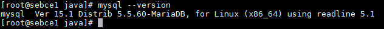
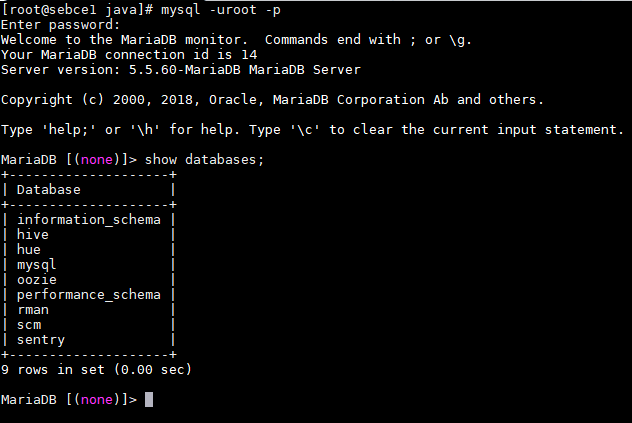

# Database Setup

### MariaDB
Since the environment uses CentOS 7.3 I installed MariaDB
Hostname of the mariadb-server `sebce1.madrid.es`.

#### On host `sebce1.madrid.es`
```
yum install -y mariadb-server
```
#### Installing client libs
```
ansible all -m yum -a "name=mariadb state=installed"
```

#### JDBC Connector
```
wget https://dev.mysql.com/get/Downloads/Connector-J/mysql-connector-java-5.1.46.tar.gz

tar -xzf mysql-connector-java-5.1.46.tar.gz
cp mysql-connector-java-5.1.46/mysql-connector-java-5.1.46-bin.jar /usr/share/java
ln -svf /usr/share/java/mysql-connector-java-5.1.46-bin.jar /usr/share/java/my-sql-connector-java.jar
```
#### Secured Installation
```
/usr/bin/mysql_secure_installation
```

#### Created Databases
```
CREATE DATABASE IF NOT EXISTS rman DEFAULT CHARACTER SET utf8;
grant all on rman.* TO 'rman'@'%' IDENTIFIED BY 'rman';

CREATE DATABASE IF NOT EXISTS hue DEFAULT CHARACTER SET utf8;
grant all on hue.* TO 'hue'@'%' IDENTIFIED BY 'hue';

CREATE DATABASE IF NOT EXISTS hive DEFAULT CHARACTER SET utf8;
grant all on hive.* TO 'hive'@'%' IDENTIFIED BY 'hive';

CREATE DATABASE IF NOT EXISTS oozie DEFAULT CHARACTER SET utf8;
grant all on oozie.* TO 'oozie'@'%' IDENTIFIED BY 'oozie';

CREATE DATABASE IF NOT EXISTS sentry DEFAULT CHARACTER SET utf8;
grant all on sentry.* TO 'sentry'@'%' IDENTIFIED BY 'sentry';

CREATE DATABASE IF NOT EXISTS scm DEFAULT CHARACTER SET utf8;
grant all on scm.* TO 'scm'@'%' IDENTIFIED BY 'scm';

FLUSH PRIVILEGES;
```

#### MySQL Version


#### Databases

