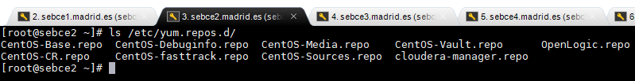
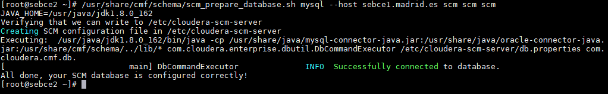

# Install CM

CM is installed in node `sebce2.madrid.es`

#### Contents of `/etc/yum.repos.d`


#### Prepare database
```
/usr/share/cmf/schema/scm_prepare_database.sh mysql --host sebce1.madrid.es scm scm scm
```
**Output**


#### db.properties
```
cat /etc/cloudera-scm-server/db.properties
```


#### Extra steps
**Disabled IPV6 and set set vm.swappiness to 1**

Added to `/etc/sysconf/network`
```
NETWORKING_IPV6=no
IPV6INIT=no
```
Added to `/etc/sysctl.conf`
```
vm.swappiness=1
net.ipv6.conf.all.disable_ipv6 = 1
net.ipv6.conf.default.disable_ipv6 = 1
net.ipv6.conf.lo.disable_ipv6 = 1
```
Executed
```
sysctl -p
```

**Disabled Transparent Hugepages**

Added to `/etc/rc.d/rc.local` and executed them in a `shell` session
```
echo never > /sys/kernel/mm/transparent_hugepage/defrag
echo never > /sys/kernel/mm/transparent_hugepage/enabled
```

**Disabled firewalld**
```
systemctl disable firewalld
systemctl stop firewalld
```
