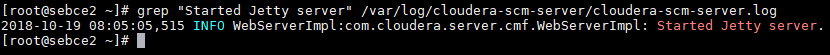

#### db.properties
```
# Auto-generated by scm_prepare_database.sh on Fri Oct 19 07:59:41 UTC 2018
#
# For information describing how to configure the Cloudera Manager Server
# to connect to databases, see the "Cloudera Manager Installation Guide."
#
com.cloudera.cmf.db.type=mysql
com.cloudera.cmf.db.host=sebce1.madrid.es
com.cloudera.cmf.db.name=scm
com.cloudera.cmf.db.user=scm
com.cloudera.cmf.db.setupType=EXTERNAL
com.cloudera.cmf.db.password=scm

```
#### First lines of the log

```
[root@sebce2 ~]# head -5 /var/log/cloudera-scm-server/cloudera-scm-server.log
2018-10-19 08:03:12,863 INFO main:com.cloudera.server.cmf.Main: ================================================================================
2018-10-19 08:03:12,882 INFO main:com.cloudera.server.cmf.Main: Starting SCM Server. JVM Args: [-Dlog4j.configuration=file:/etc/cloudera-scm-server/log4j.properties, -Dfile.encoding=UTF-8, -Dcmf.root.logger=INFO,LOGFILE, -Dcmf.log.dir=/var/log/cloudera-scm-server, -Dcmf.log.file=cloudera-scm-server.log, -Dcmf.jetty.threshhold=WARN, -Dcmf.schema.dir=/usr/share/cmf/schema, -Djava.awt.headless=true, -Djava.net.preferIPv4Stack=true, -Dpython.home=/usr/share/cmf/python, -XX:+UseConcMarkSweepGC, -XX:+UseParNewGC, -XX:+HeapDumpOnOutOfMemoryError, -Xmx2G, -XX:MaxPermSize=256m, -XX:+HeapDumpOnOutOfMemoryError, -XX:HeapDumpPath=/tmp, -XX:OnOutOfMemoryError=kill -9 %p], Args: [], Version: 5.14.4 (#3 built by jenkins on 20180707-0445 git: 0971e84bdceb60db9b96533f46451f40ed8cbdf9)
2018-10-19 08:03:12,980 INFO main:org.mortbay.log: Logging to org.slf4j.impl.Log4jLoggerAdapter(org.mortbay.log) via org.mortbay.log.Slf4jLog
2018-10-19 08:03:13,101 INFO main:org.springframework.context.support.ClassPathXmlApplicationContext: Refreshing org.springframework.context.support.ClassPathXmlApplicationContext@30a3107a: startup date [Fri Oct 19 08:03:13 UTC 2018]; root of context hierarchy
2018-10-19 08:03:13,164 INFO main:org.springframework.beans.factory.xml.XmlBeanDefinitionReader: Loading XML bean definitions from class path resource [webapp/WEB-INF/spring/beanRefFactory.xml]
```
#### Jetty Server started line
**Executed**
```
grep "Started Jetty server" /var/log/cloudera-scm-server/cloudera-scm-server.log
```

