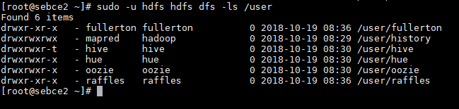
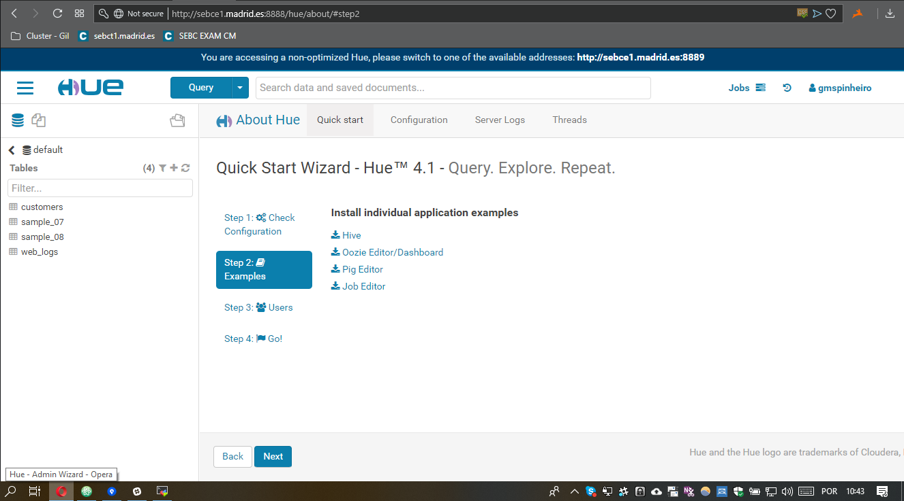

# Install CDH
The CDH version is the same as the CM (5.14.4)


#### HDFS `/user/` contents

**Executed**
```
sudo -u hdfs hdfs dfs -ls /user
```


#### API call `api/v14/hosts`
````
[root@sebce2 ~]# curl -u admin:admin -X GET http://sebce2.madrid.es:7180/api/v14/hosts
{
  "items" : [ {
    "hostId" : "84879961-80a2-40e3-93bf-03c6e3f42ef4",
    "ipAddress" : "10.0.6.4",
    "hostname" : "sebce1.madrid.es",
    "rackId" : "/default",
    "hostUrl" : "http://sebce2.madrid.es:7180/cmf/hostRedirect/84879961-80a2-40e3-93bf-03c6e3f42ef4",
    "maintenanceMode" : false,
    "maintenanceOwners" : [ ],
    "commissionState" : "COMMISSIONED",
    "numCores" : 4,
    "numPhysicalCores" : 2,
    "totalPhysMemBytes" : 16810840064
  }, {
    "hostId" : "d7222b65-7895-48c9-a9c2-6fcda9d28b4e",
    "ipAddress" : "10.0.6.5",
    "hostname" : "sebce2.madrid.es",
    "rackId" : "/default",
    "hostUrl" : "http://sebce2.madrid.es:7180/cmf/hostRedirect/d7222b65-7895-48c9-a9c2-6fcda9d28b4e",
    "maintenanceMode" : false,
    "maintenanceOwners" : [ ],
    "commissionState" : "COMMISSIONED",
    "numCores" : 4,
    "numPhysicalCores" : 2,
    "totalPhysMemBytes" : 16810840064
  }, {
    "hostId" : "0686c581-e8bd-4541-ac46-4c494e11f802",
    "ipAddress" : "10.0.6.6",
    "hostname" : "sebce3.madrid.es",
    "rackId" : "/default",
    "hostUrl" : "http://sebce2.madrid.es:7180/cmf/hostRedirect/0686c581-e8bd-4541-ac46-4c494e11f802",
    "maintenanceMode" : false,
    "maintenanceOwners" : [ ],
    "commissionState" : "COMMISSIONED",
    "numCores" : 4,
    "numPhysicalCores" : 2,
    "totalPhysMemBytes" : 16810840064
  }, {
    "hostId" : "ec004bf3-82d6-490e-8439-2b7c2ee04d6f",
    "ipAddress" : "10.0.6.7",
    "hostname" : "sebce4.madrid.es",
    "rackId" : "/default",
    "hostUrl" : "http://sebce2.madrid.es:7180/cmf/hostRedirect/ec004bf3-82d6-490e-8439-2b7c2ee04d6f",
    "maintenanceMode" : false,
    "maintenanceOwners" : [ ],
    "commissionState" : "COMMISSIONED",
    "numCores" : 4,
    "numPhysicalCores" : 2,
    "totalPhysMemBytes" : 16810840064
  }, {
    "hostId" : "fee56e10-a0e4-4800-91df-363d3228ad4b",
    "ipAddress" : "10.0.6.8",
    "hostname" : "sebce5.madrid.es",
    "rackId" : "/default",
    "hostUrl" : "http://sebce2.madrid.es:7180/cmf/hostRedirect/fee56e10-a0e4-4800-91df-363d3228ad4b",
    "maintenanceMode" : false,
    "maintenanceOwners" : [ ],
    "commissionState" : "COMMISSIONED",
    "numCores" : 4,
    "numPhysicalCores" : 2,
    "totalPhysMemBytes" : 16810840064
  } ]

````

#### Hue installed

