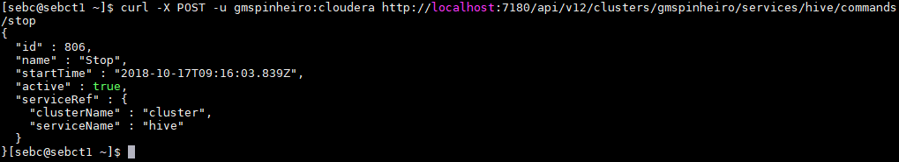
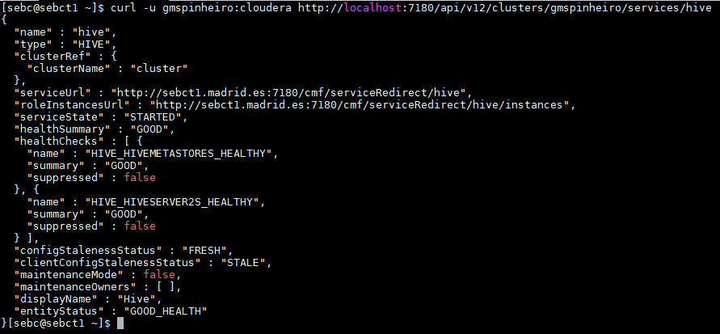

# Hive commands

The commands were run in the host running the Cloudera Manager, hence the `localhost`. Otherwise, the calls can be performed from outside the cluster using the `http://sebct1.eastus.cloudapp.azure.com:7180` url.

* #### Stop
````
curl -X POST -u gmspinheiro:cloudera http://localhost:7180/api/v12/clusters/gmspinheiro/services/hive/command/stop
````


* #### Start
 ````
 curl -X POST -u gmspinheiro:cloudera http://localhost:7180/api/v12/clusters/gmspinheiro/services/hive/command/start
 ````


* #### Check Status
```
curl -u gmspinheiro:cloudera http://localhost:7180/api/v12/clusters/gmspinheiro/services/hive
```

