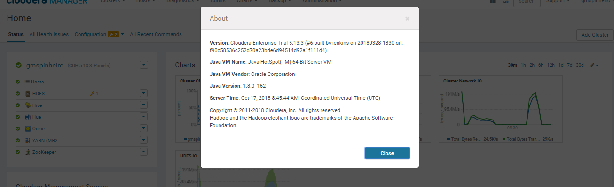
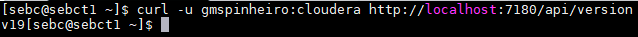
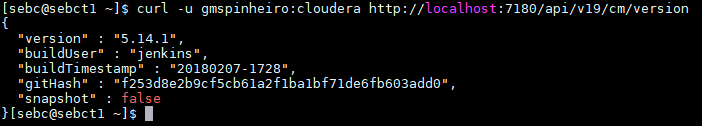
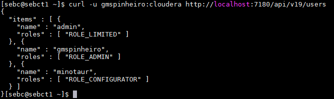
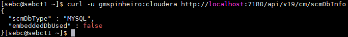

# CM Upgrade
Backups of the Cloudera Managment Services and support databases were performed on host `sebct1` and are located in the `/root/cm_upgrade_2018-10-17-CM` directory.

The image below showcases the previous installed version of Cloudera Manager.

## API Calls
#### API Version
`curl -u gmspinheiro:cloudera http://localhost:7180/api/version`

#### CM Version
`curl -u gmspinheiro:cloudera http://localhost:7180/api/v19/cm/version`

#### CM Users
`curl -u gmspinheiro:cloudera http://localhost:7180/api/v19/users`

#### CM Database
`curl -u gmspinheiro:cloudera http://localhost:7180/api/v19/cm/scmDbInfo`

