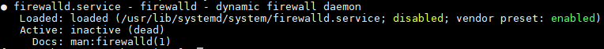
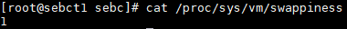
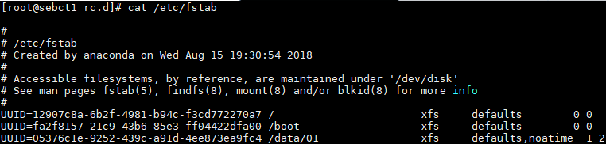
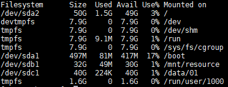
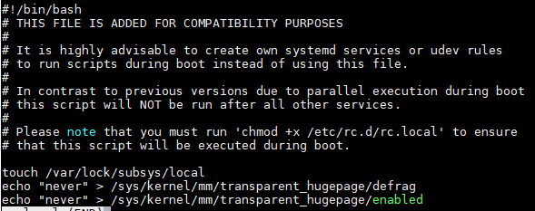
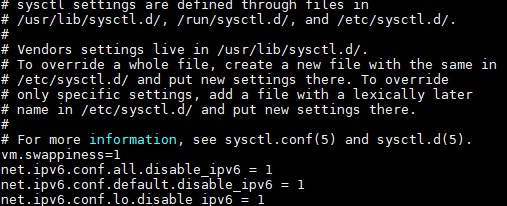
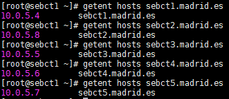
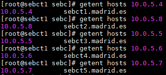
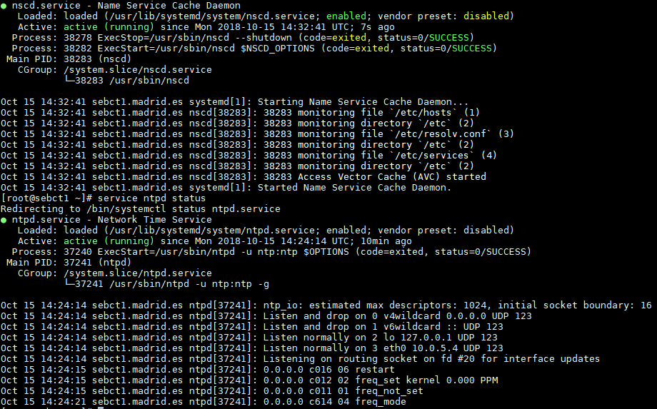
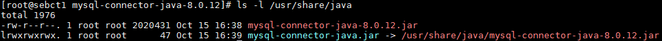

# Pre-Install
## Host Specifications
For this bootcamp the **Azure** Cloud provider was chosen to deploy 5 **D4S_V3** instances running **CentOS 7.5** with unmanaged disks.

DS4_V3 instances feature 4 vCPUS and 16 GB of RAM. Furthermore, each host has 2 HDD disks. One for the OS with 50GB of size and one data disk of 40GB, both partitioned with the **XFS** filesystem.

IP and DNS resolution is done automatically by Azure itself. Furthermore, IP addresses were configured as static and can be seen **[here](0_nodeIPs.md)**.

The hosts can be accessed via SSH with the user `sebc`. **Note:** this user has sudo privileges without the need for the password.

## Ansible
Ansible was installed in the `sect1` host to provide easy access to parallelize certain operations.

The following commands were issued in order to install Ansible:
#### Enable epel repo
`yum -y install epel-release`

#### Install Ansible
`yum -y install ansible`

## 1 - System Configuration Checks

 ### First Steps
  * #### Disabled SELinux
Edited the contents of the `/etc/sysconf/selinunx` file to the following:

```
# This file controls the state of SELinux on the system.
# SELINUX= can take one of these three values:
#     enforcing - SELinux security policy is enforced.
#     permissive - SELinux prints warnings instead of enforcing.
#     disabled - No SELinux policy is loaded.
SELINUX=disabled
# SELINUXTYPE= can take one of three two values:
#     targeted - Targeted processes are protected,
#     minimum - Modification of targeted policy. Only selected processes are protected.
#     mls - Multi Level Security protection.
SELINUXTYPE=targeted
```

 * #### Stopped and disabled the firewall

```
systemctl stop firewalld
systemctl disable firewalld
```

#### Firewalld service status:




### Disabling Swap
```
echo -e "vm.swappiness=1" >> /etc/sysctl.conf
echo "1" >> /proc/sys/vm/swappiness
```
##### Verification for host `sebct1`


### Mount attributes of all the volumes
The contents of the `/etc/fstab` file show the current mount attributes of all the volumes.

The image below shows the conents of such file for host `sebct1`.



The current disks layout for host `sebct1`:



**Note: As per the guidelines the disks formatted in XFS do not maintain reserved space**.

### Disable transparent hugespace support
#### Effective immediatly

```
echo never > /sys/kernel/mm/transparent_hugepage/defrag
echo never > /sys/kernel/mm/transparent_hugepage/enabled
```

##### Contents of `/etc/rc.d/rc.local` file of host `sebct1`


### Network Interface configuration
##### Disabling IPV6
IPV6 was disabled by editing the `/etc/sysctl.conf` file and executing the command `sysctl -p`.

The image below showcases the contents of the file for the host `sebct1`.



As expected, the command `lsmod | grep ipv6` command produces no output.

Since the OS used is CentOS 7.5, extra options were appended to the `/etc/sysconfig/network` file.

```
NETWORKING_IPV6=no
IPV6INIT=no
```

### Forward and reserve lookups using `getent`
Output of the `getent` command executed from the host `sebct1`.

##### Forward


##### Reverse


### Services `nscd` and `ntpd`
##### Install
Services NSCD and NTPD were installed using the following commands:
```
yum install -y nscd ntp
systemctl enable nscd
systemctl enable ntpd

ntpd -q

#Needed for CentOS
systemctl disable chronyd

systemctl start nscd
systemctl start ntpd
```

NSCD is configured to only cache `hosts` and `services` as shown below.

````
#
# /etc/nscd.conf
#
# An example Name Service Cache config file.  This file is needed by nscd.
#
# Legal entries are:
#
#       logfile                 <file>
#       debug-level             <level>
#       threads                 <initial #threads to use>
#       max-threads             <maximum #threads to use>
#       server-user             <user to run server as instead of root>
#               server-user is ignored if nscd is started with -S parameters
#       stat-user               <user who is allowed to request statistics>
#       reload-count            unlimited|<number>
#       paranoia                <yes|no>
#       restart-interval        <time in seconds>
#
#       enable-cache            <service> <yes|no>
#       positive-time-to-live   <service> <time in seconds>
#       negative-time-to-live   <service> <time in seconds>
#       suggested-size          <service> <prime number>
#       check-files             <service> <yes|no>
#       persistent              <service> <yes|no>
#       shared                  <service> <yes|no>
#       max-db-size             <service> <number bytes>
#       auto-propagate          <service> <yes|no>
#
# Currently supported cache names (services): passwd, group, hosts, services
#


#       logfile                 /var/log/nscd.log
#       threads                 4
#       max-threads             32
        server-user             nscd
#       stat-user               somebody
        debug-level             0
#       reload-count            5
        paranoia                no
#       restart-interval        3600

        enable-cache            passwd          no
        positive-time-to-live   passwd          600
        negative-time-to-live   passwd          20
        suggested-size          passwd          211
        check-files             passwd          yes
        persistent              passwd          yes
        shared                  passwd          yes
        max-db-size             passwd          33554432
        auto-propagate          passwd          yes

        enable-cache            group           no
        positive-time-to-live   group           3600
        negative-time-to-live   group           60
        suggested-size          group           211
        check-files             group           yes
        persistent              group           yes
        shared                  group           yes
        max-db-size             group           33554432
        auto-propagate          group           yes

        enable-cache            hosts           yes
        positive-time-to-live   hosts           3600
        negative-time-to-live   hosts           20
        suggested-size          hosts           211
        check-files             hosts           yes
        persistent              hosts           yes
        shared                  hosts           yes
        max-db-size             hosts           33554432

        enable-cache            services        yes
        positive-time-to-live   services        28800
        negative-time-to-live   services        20
        suggested-size          services        211
        check-files             services        yes
        persistent              services        yes
        shared                  services        yes
        max-db-size             services        33554432

        enable-cache            netgroup        no
        positive-time-to-live   netgroup        28800
        negative-time-to-live   netgroup        20
        suggested-size          netgroup        211
        check-files             netgroup        yes
        persistent              netgroup        yes
        shared                  netgroup        yes
        max-db-size             netgroup        33554432

````


#### Services status
The image shows the services status for host `sebct1`.



## 2 - Support Database (MariaDB)
As per the guidelines and since the hosts are running CentOS 7.5 the support database is MariaDB. MariaDB 5.5 is already included in the base repository, and as such, the installation was as follows:

### Package installation
##### DB Servers (`sebct1` and `sebct2`)

````
yum -y install mariadb-server

systemctl enable mariadb
````

##### Other nodes (`sebct[3-5]`)
`yum -y install mariadb`

### Installing the MySQL JDBC driver
The MariaDB JDBC driver is not supported, so the MySQL JDBC driver was downloaded instead.

* Downloaded the JDBC driver in the **tar.gz** distribution from [here](https://dev.mysql.com/get/Downloads/Connector-J/mysql-connector-java-8.0.12.tar.gz).

* Extracted the contents, copied the **.jar** file to the `/usr/share/java` folder and created a symlink for `mysql-connector-java`.

````
cp mysql-connector-java-8.0.12/mysql-connector-java-8.0.12.jar /usr/share/java

ln -svf /usr/share/java/mysql-connector-java-8.0.12.jar /usr/share/java/mysql-connector-java.jar
````

Output of the list command in the `/usr/share/java`.



### Replication Setup

Changed the contents of the `/etc/my.cnf` in both hosts. **Note:** **server_id** was setup with unique value for each host.

````
[mysqld]
datadir=/var/lib/mysql
socket=/var/lib/mysql/mysql.sock
transaction-isolation = READ-COMMITTED
# Disabling symbolic-links is recommended to prevent assorted security risks;
# to do so, uncomment this line:
symbolic-links = 0
# Settings user and group are ignored when systemd is used.
# If you need to run mysqld under a different user or group,
# customize your systemd unit file for mariadb according to the
# instructions in http://fedoraproject.org/wiki/Systemd

key_buffer = 16M
key_buffer_size = 32M
max_allowed_packet = 32M
thread_stack = 256K
thread_cache_size = 64
query_cache_limit = 8M
query_cache_size = 64M
query_cache_type = 1

max_connections = 550
expire_logs_days = 10
#max_binlog_size = 100M

#log_bin should be on a disk with enough free space.
#Replace '/var/lib/mysql/mysql_binary_log' with an appropriate path for your
#system and chown the specified folder to the mysql user.
log_bin=/var/lib/mysql/mysql_binary_log

#In later versions of MariaDB, if you enable the binary log and do not set
#a server_id, MariaDB will not start. The server_id must be unique within
#the replicating group.
server_id=1

binlog_format = ROW

read_buffer_size = 2M
read_rnd_buffer_size = 16M
sort_buffer_size = 8M
join_buffer_size = 8M

# InnoDB settings
innodb_file_per_table = 1
innodb_flush_log_at_trx_commit  = 2
innodb_log_buffer_size = 64M
innodb_buffer_pool_size = 4G
innodb_thread_concurrency = 8
innodb_flush_method = O_DIRECT
innodb_log_file_size = 512M

[mysqld_safe]
log-error=/var/log/mariadb/mariadb.log
pid-file=/var/run/mariadb/mariadb.pid

#
# include all files from the config directory
#
!includedir /etc/my.cnf.d

````

* #### Secured Installation

```
systemctl start mariadb
/usr/bin/mysql_secure_installation
```

The result of the replication setup can be seen in [2_replica_working.md](22_replica_working.md).

## Cloudera Manager & CDH Installation

Cloudera Manager 5.13.3 was installed by downloading the cloudera-manager.repo file and placing it in the `/etc/yum.repos.d/` directory in host `sebct1`.

The support database was prepared using the `/usr/share/cmf/schema/scm_prepare_database.sh` script file.

CDH with Core Hadoop was installed using parcels and the current CDH version is **5.13.3**.

The cluster features 3 Master nodes and 2 datanodes. Access tot he cluster can be done by navigating to the [http://sebct1.eastus.cloudapp.azure.com:7180](http://sebct1.eastus.cloudapp.azure.com:7180) url.

## Local Repo

A local parcel repository was setup in host `sebct2` and can be accessed via [http://sebct2.eastus.cloudapp.azure.com/cloudera-repos](http://sebct2.madrid.es/cloudera-repos).

The following parcels were setup:
* CDH 5.13.3
* Kafka 3.1.0.35
* Accumulo-c5
* gplextras5 (5.13.3)
