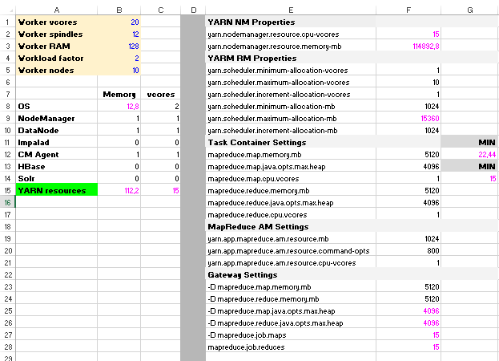

## Step 1 - YARN Calculations

Cluster worker specifications:
* 128GB RAM
* 20 vcores
* 12 disks on the datanodes

The memory reservation for the OS was kept at 10%. The vcores reserved for the OS, the datanode and nodemanager processes and the CM agent were unchanged.

The resulting available resources for YARN per worker are as follows:
* 112,2 RAM
* 15 vcores

#### Changes
I have changed `yarn.scheduler.maximum-allocation-vcores
` to 10. This way, a CPU intensive application can reserve the majority of the available cores, but still leaves 5 cores left available for other applications.

Since we have so much available memory per node, I have changed the `mapreduce.map.memory.mb
` and `mapreduce.reduce.memory.mb` to `5120` which is equivalent to 1/3 of the `yarn.scheduler.maximum-allocation-mb`. Since we changed these parameters, the according `mapreduce.map.java.opts.max.heap
` and `mapreduce.reduce.java.opts.max.heap` were changed to 80% of aforementioned values.

Finnaly, I changed the gateway client-side settings to match the previous properties' values. Since these settings can be overriden, the current values are just a suggestion.

````
-D mapreduce.map.memory.mb = 5120
-D mapreduce.reduce.memory.mb = 5120
````
#### Final worksheet



## Step 2 - Workload Factor

The workload factor should be affected by the number of cores and spindles. A value of 2 (or higher) is normally associated to more I/O bound tasks. A value lower than 2 should be used for CPU intensive tasks.
