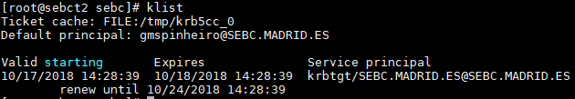

# Kerberos Setup
### Deployment
For the Kerberos depoyment, a KDC and a kadmin service were setup in the host `sebct2`. In the current cluster deployment, krb5.conf files are managed by the Cloudera Manager.

The configured realm name is **SEBC.MADRID.ES**

For the installation, the following commands were executed:
  * on host `sebct2`
    - `yum install -y krb5-workstation krb5-libs krb5-server`
    - `kdb5_util create -s`

  * on the rest of the hosts
    - `yum install -y krb5-workstation krb5-libs`

### Kinit command for user `gmspinheiro`
`kinit gmspinheiro@SEBC.MADRID.ES`

### Output of the `klist` command:

