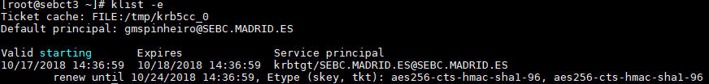
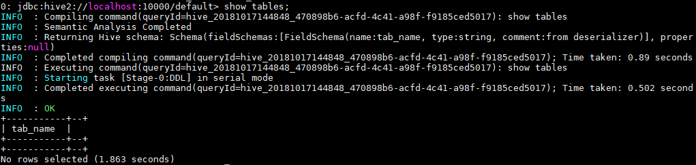
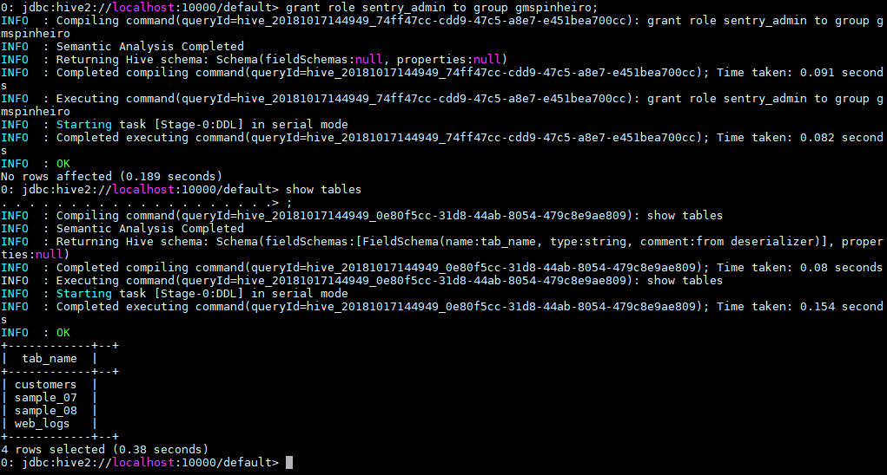
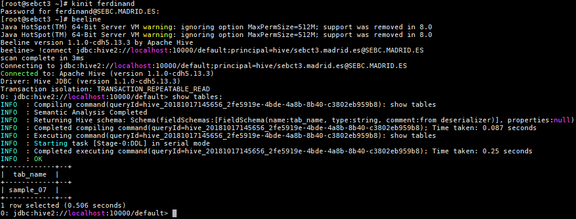
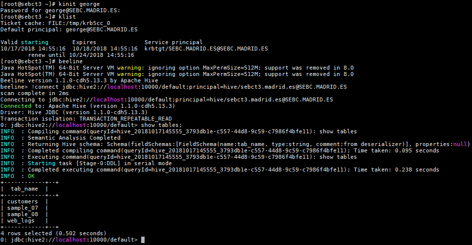

# Sentry test

## Configuring Sentry for an administrator

#### Current Kerberos authenticated user



#### Beeline connect command
```
!connect jdbc:hive2://localhost:10000/default;principal=hive/sebct3.madrid.es@SEBC.MADRID.ES
```

#### Result of first `SHOW TABLES;`



#### Result of second `SHOW TABLES;` after `GRANT ALL ON SERVER`


## Configuring permissions for users `george` and `ferdinand`
The images below contains the information about each kerberos ticket for each user and the corresponding beeline connections and outputs of the `SHOW TABLES;` query

#### Ferdidand SHOW TABLES output

#### George SHOW TABLES output

