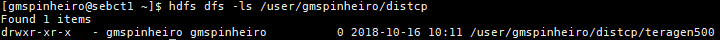
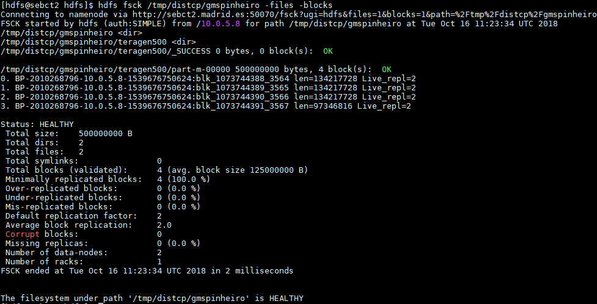
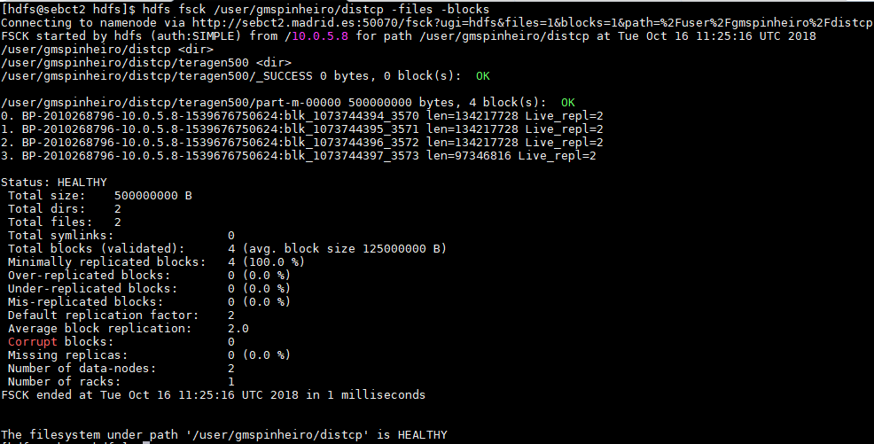

# Local DistCP

### Pre-Setup

In order to showcase the execution of the DistCP operation, a local cluster DistCP was performed between two directories.

Two directories were created and given permissions for the user `gmspinheiro`.

```
hdfs dfs -mkdir /user/gmspinheiro/distcp
hdfs dfs -mkdir /tmp/distcp/gmspinheiro
hdfs dfs -chown gmspinheiro:gmspinheiro /tmp/distcp/gmspinheiro
```

* Then the teragen command

````
time yarn jar /opt/cloudera/parcels/CDH/lib/hadoop-mapreduce/hadoop-mapreduce-examples.jar teragen 5000000  /tmp/distcp/gmspinheiro/teragen500
18/10/16 10:09:19 INFO Configuration.deprecation: session.id is deprecated. Instead, use dfs.metrics.session-id
18/10/16 10:09:19 INFO jvm.JvmMetrics: Initializing JVM Metrics with processName=JobTracker, sessionId=
18/10/16 10:09:20 INFO terasort.TeraGen: Generating 5000000 using 1
18/10/16 10:09:20 INFO mapreduce.JobSubmitter: number of splits:1
18/10/16 10:09:20 INFO mapreduce.JobSubmitter: Submitting tokens for job: job_local1400060705_0001
18/10/16 10:09:20 INFO mapreduce.Job: The url to track the job: http://localhost:8080/
18/10/16 10:09:20 INFO mapreduce.Job: Running job: job_local1400060705_0001
18/10/16 10:09:20 INFO mapred.LocalJobRunner: OutputCommitter set in config null
18/10/16 10:09:20 INFO output.FileOutputCommitter: File Output Committer Algorithm version is 1
18/10/16 10:09:20 INFO output.FileOutputCommitter: FileOutputCommitter skip cleanup _temporary folders under output directory:false, ignore cleanup failures: false
18/10/16 10:09:20 INFO mapred.LocalJobRunner: OutputCommitter is org.apache.hadoop.mapreduce.lib.output.FileOutputCommitter
18/10/16 10:09:20 INFO mapred.LocalJobRunner: Waiting for map tasks
18/10/16 10:09:20 INFO mapred.LocalJobRunner: Starting task: attempt_local1400060705_0001_m_000000_0
18/10/16 10:09:20 INFO output.FileOutputCommitter: File Output Committer Algorithm version is 1
18/10/16 10:09:20 INFO output.FileOutputCommitter: FileOutputCommitter skip cleanup _temporary folders under output directory:false, ignore cleanup failures: false
18/10/16 10:09:20 INFO mapred.Task:  Using ResourceCalculatorProcessTree : [ ]
18/10/16 10:09:20 INFO mapred.MapTask: Processing split: org.apache.hadoop.examples.terasort.TeraGen$RangeInputFormat$RangeInputSplit@63af7efd
18/10/16 10:09:21 INFO mapreduce.Job: Job job_local1400060705_0001 running in uber mode : false
18/10/16 10:09:21 INFO mapreduce.Job:  map 0% reduce 0%
18/10/16 10:09:26 INFO mapred.LocalJobRunner:
18/10/16 10:09:26 INFO mapred.Task: Task:attempt_local1400060705_0001_m_000000_0 is done. And is in the process of committing
18/10/16 10:09:26 INFO mapred.LocalJobRunner:
18/10/16 10:09:26 INFO mapred.Task: Task attempt_local1400060705_0001_m_000000_0 is allowed to commit now
18/10/16 10:09:26 INFO output.FileOutputCommitter: Saved output of task 'attempt_local1400060705_0001_m_000000_0' to hdfs://sebct2.madrid.es:8020/tmp/distcp/gmspinheiro/teragen500/_temporary/0/task_local1400060705_0001_m_000000
18/10/16 10:09:26 INFO mapred.LocalJobRunner: map
18/10/16 10:09:26 INFO mapred.Task: Task 'attempt_local1400060705_0001_m_000000_0' done.
18/10/16 10:09:26 INFO mapred.LocalJobRunner: Finishing task: attempt_local1400060705_0001_m_000000_0
18/10/16 10:09:26 INFO mapred.LocalJobRunner: map task executor complete.
18/10/16 10:09:27 INFO mapreduce.Job:  map 100% reduce 0%
18/10/16 10:09:27 INFO mapreduce.Job: Job job_local1400060705_0001 completed successfully
18/10/16 10:09:27 INFO mapreduce.Job: Counters: 21
        File System Counters
                FILE: Number of bytes read=276518
                FILE: Number of bytes written=627920
                FILE: Number of read operations=0
                FILE: Number of large read operations=0
                FILE: Number of write operations=0
                HDFS: Number of bytes read=0
                HDFS: Number of bytes written=500000000
                HDFS: Number of read operations=4
                HDFS: Number of large read operations=0
                HDFS: Number of write operations=3
        Map-Reduce Framework
                Map input records=5000000
                Map output records=5000000
                Input split bytes=82
                Spilled Records=0
                Failed Shuffles=0
                Merged Map outputs=0
                GC time elapsed (ms)=30
                Total committed heap usage (bytes)=435683328
        org.apache.hadoop.examples.terasort.TeraGen$Counters
                CHECKSUM=10735710707299981
        File Input Format Counters
                Bytes Read=0
        File Output Format Counters
                Bytes Written=500000000

real    0m11.654s
user    0m17.348s
sys     0m1.546s

````

### The local cluster DistCP command:

````
[gmspinheiro@sebct1 ~]$ hadoop distcp /tmp/distcp/gmspinheiro/teragen500 /user/gmspinheiro/distcp
18/10/16 10:11:26 INFO tools.OptionsParser: parseChunkSize: blocksperchunk false
18/10/16 10:11:27 INFO tools.DistCp: Input Options: DistCpOptions{atomicCommit=false, syncFolder=false, deleteMissing=false, ignoreFailures=false, overwrite=false, append=false, useDiff=false, useRdiff=false, fromSnapshot=null, toSnapshot=null, skipCRC=false, blocking=true, numListstatusThreads=0, maxMaps=20, mapBandwidth=100, sslConfigurationFile='null', copyStrategy='uniformsize', preserveStatus=[], preserveRawXattrs=false, atomicWorkPath=null, logPath=null, sourceFileListing=null, sourcePaths=[/tmp/distcp/gmspinheiro/teragen500], targetPath=/user/gmspinheiro/distcp, targetPathExists=true, filtersFile='null', blocksPerChunk=0, copyBufferSize=8192}
18/10/16 10:11:27 INFO Configuration.deprecation: session.id is deprecated. Instead, use dfs.metrics.session-id
18/10/16 10:11:27 INFO jvm.JvmMetrics: Initializing JVM Metrics with processName=JobTracker, sessionId=
18/10/16 10:11:27 INFO tools.SimpleCopyListing: Paths (files+dirs) cnt = 3; dirCnt = 1
18/10/16 10:11:27 INFO tools.SimpleCopyListing: Build file listing completed.
18/10/16 10:11:27 INFO Configuration.deprecation: io.sort.mb is deprecated. Instead, use mapreduce.task.io.sort.mb
18/10/16 10:11:27 INFO Configuration.deprecation: io.sort.factor is deprecated. Instead, use mapreduce.task.io.sort.factor
18/10/16 10:11:27 INFO tools.DistCp: Number of paths in the copy list: 3
18/10/16 10:11:27 INFO tools.DistCp: Number of paths in the copy list: 3
18/10/16 10:11:27 INFO jvm.JvmMetrics: Cannot initialize JVM Metrics with processName=JobTracker, sessionId= - already initialized
18/10/16 10:11:27 INFO mapreduce.JobSubmitter: number of splits:1
18/10/16 10:11:27 INFO mapreduce.JobSubmitter: Submitting tokens for job: job_local1713201595_0001
18/10/16 10:11:28 INFO mapreduce.Job: The url to track the job: http://localhost:8080/
18/10/16 10:11:28 INFO tools.DistCp: DistCp job-id: job_local1713201595_0001
18/10/16 10:11:28 INFO mapreduce.Job: Running job: job_local1713201595_0001
18/10/16 10:11:28 INFO mapred.LocalJobRunner: OutputCommitter set in config null
18/10/16 10:11:28 INFO output.FileOutputCommitter: File Output Committer Algorithm version is 1
18/10/16 10:11:28 INFO output.FileOutputCommitter: FileOutputCommitter skip cleanup _temporary folders under output directory:false, ignore cleanup failures: false
18/10/16 10:11:28 INFO mapred.LocalJobRunner: OutputCommitter is org.apache.hadoop.tools.mapred.CopyCommitter
18/10/16 10:11:28 INFO mapred.LocalJobRunner: Waiting for map tasks
18/10/16 10:11:28 INFO mapred.LocalJobRunner: Starting task: attempt_local1713201595_0001_m_000000_0
18/10/16 10:11:28 INFO output.FileOutputCommitter: File Output Committer Algorithm version is 1
18/10/16 10:11:28 INFO output.FileOutputCommitter: FileOutputCommitter skip cleanup _temporary folders under output directory:false, ignore cleanup failures: false
18/10/16 10:11:28 INFO mapred.Task:  Using ResourceCalculatorProcessTree : [ ]
18/10/16 10:11:28 INFO mapred.MapTask: Processing split: file:/tmp/hadoop-gmspinheiro/mapred/staging/gmspinheiro1537186123/.staging/_distcp619679219/fileList.seq:0+677
18/10/16 10:11:28 INFO output.FileOutputCommitter: File Output Committer Algorithm version is 1
18/10/16 10:11:28 INFO output.FileOutputCommitter: FileOutputCommitter skip cleanup _temporary folders under output directory:false, ignore cleanup failures: false
18/10/16 10:11:28 INFO mapred.CopyMapper: Copying hdfs://sebct2.madrid.es:8020/tmp/distcp/gmspinheiro/teragen500 to hdfs://sebct2.madrid.es:8020/user/gmspinheiro/distcp/teragen500
18/10/16 10:11:28 INFO mapred.CopyMapper: Copying hdfs://sebct2.madrid.es:8020/tmp/distcp/gmspinheiro/teragen500/_SUCCESS to hdfs://sebct2.madrid.es:8020/user/gmspinheiro/distcp/teragen500/_SUCCESS
18/10/16 10:11:28 INFO mapred.RetriableFileCopyCommand: Creating temp file: hdfs://sebct2.madrid.es:8020/user/gmspinheiro/distcp/.distcp.tmp.attempt_local1713201595_0001_m_000000_0
18/10/16 10:11:28 INFO mapred.CopyMapper: Copying hdfs://sebct2.madrid.es:8020/tmp/distcp/gmspinheiro/teragen500/part-m-00000 to hdfs://sebct2.madrid.es:8020/user/gmspinheiro/distcp/teragen500/part-m-00000
18/10/16 10:11:28 INFO mapred.RetriableFileCopyCommand: Creating temp file: hdfs://sebct2.madrid.es:8020/user/gmspinheiro/distcp/.distcp.tmp.attempt_local1713201595_0001_m_000000_0
18/10/16 10:11:29 INFO mapreduce.Job: Job job_local1713201595_0001 running in uber mode : false
18/10/16 10:11:29 INFO mapreduce.Job:  map 0% reduce 0%
18/10/16 10:11:33 INFO mapred.LocalJobRunner:
18/10/16 10:11:33 INFO mapred.Task: Task:attempt_local1713201595_0001_m_000000_0 is done. And is in the process of committing
18/10/16 10:11:33 INFO mapred.LocalJobRunner:
18/10/16 10:11:33 INFO mapred.Task: Task attempt_local1713201595_0001_m_000000_0 is allowed to commit now
18/10/16 10:11:33 INFO output.FileOutputCommitter: Saved output of task 'attempt_local1713201595_0001_m_000000_0' to file:/tmp/hadoop-gmspinheiro/mapred/staging/gmspinheiro1537186123/.staging/_distcp619679219/_logs/_temporary/0/task_local1713201595_0001_m_000000
18/10/16 10:11:33 INFO mapred.LocalJobRunner: 100.0% Copying hdfs://sebct2.madrid.es:8020/tmp/distcp/gmspinheiro/teragen500/part-m-00000 to hdfs://sebct2.madrid.es:8020/user/gmspinheiro/distcp/teragen500/part-m-00000 [476.8M/476.8M]
18/10/16 10:11:33 INFO mapred.Task: Task 'attempt_local1713201595_0001_m_000000_0' done.
18/10/16 10:11:33 INFO mapred.LocalJobRunner: Finishing task: attempt_local1713201595_0001_m_000000_0
18/10/16 10:11:33 INFO mapred.LocalJobRunner: map task executor complete.
18/10/16 10:11:33 INFO mapred.CopyCommitter: concat file chunks ...
18/10/16 10:11:34 INFO mapred.CopyCommitter: Cleaning up temporary work folder: file:/tmp/hadoop-gmspinheiro/mapred/staging/gmspinheiro1537186123/.staging/_distcp619679219
18/10/16 10:11:34 INFO mapreduce.Job:  map 100% reduce 0%
18/10/16 10:11:34 INFO mapreduce.Job: Job job_local1713201595_0001 completed successfully
18/10/16 10:11:34 INFO mapreduce.Job: Counters: 23
        File System Counters
                FILE: Number of bytes read=1970909
                FILE: Number of bytes written=2342970
                FILE: Number of read operations=0
                FILE: Number of large read operations=0
                FILE: Number of write operations=0
                HDFS: Number of bytes read=500000000
                HDFS: Number of bytes written=500000000
                HDFS: Number of read operations=26
                HDFS: Number of large read operations=0
                HDFS: Number of write operations=5
        Map-Reduce Framework
                Map input records=3
                Map output records=0
                Input split bytes=169
                Spilled Records=0
                Failed Shuffles=0
                Merged Map outputs=0
                GC time elapsed (ms)=62
                Total committed heap usage (bytes)=177733632
        File Input Format Counters
                Bytes Read=713
        File Output Format Counters
                Bytes Written=8
        DistCp Counters
                Bytes Copied=500000000
                Bytes Expected=500000000
                Files Copied=3
[gmspinheiro@sebct1 ~]$

````

### Contents of the target directory `/user/gmspinheiro/distcp/`



### HDFS FSCK
#### Source


#### Destination

