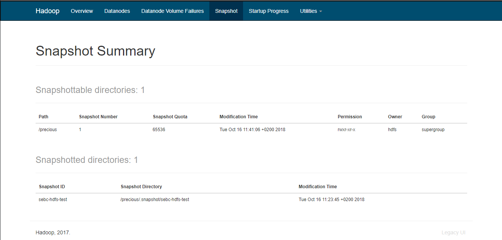

# HDFS Snapshots
For this challenge, the commands were executed with the `hdfs` user.

* Created the directory `/precious` with the command `hdfs dfs -mkdir /precious`
* Placed the `SEBC-master.zip` file inside the directory with the command `hdfs dfs -put SEBC-master.zip /precious/`
* Enabled snapshots via the CM Admin console HDFS File browser
* Created a snapshot named 'sebc-hdfs-test' for the directory `/precious`
* Removed the `SEBC-master.zip` file
* Restored the directory via the CM Admin Console HDFS browser with `distCP`.

The results of these operations can be seen in the image below:

The respective distCP application is `job_1539677842243_0001` accessible in [http://sebct2.eastus.cloudapp.azure.com:19888/jobhistory/job/job_1539677842243_0001](http://sebct2.eastus.cloudapp.azure.com:19888/jobhistory/job/job_1539677842243_0001).
